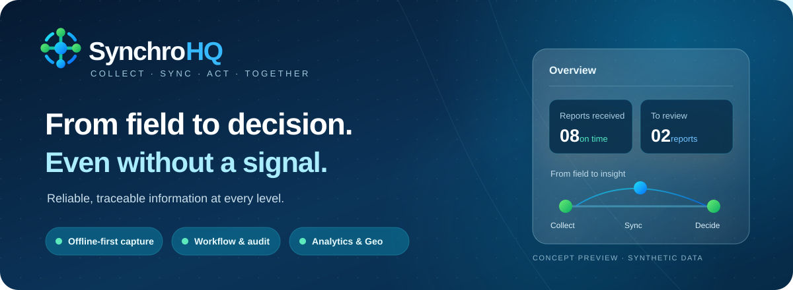

# SynchroHQ — From Field Intelligence to Better Decisions

<p align="center">
  
</p>

<p align="center">
  <strong>One platform. Every level of your organization. A clearer picture of what matters.</strong>
</p>

<p align="center">
  <strong>Collect anywhere · Stay connected offline · Act on reliable information</strong>
</p>

---

## Turn fragmented information into coordinated action

**Every day, critical information is collected across offices, territories, field teams, and operational units. But collecting information is only the beginning.**

Reports arrive late. Data gets scattered. Important updates are buried in conversations, spreadsheets, and disconnected systems. Decision-makers struggle to see what is happening, where action is needed, and whether information can be trusted.

**SynchroHQ brings everything together.**

A unified platform designed to help organizations collect information, coordinate reporting, monitor operations, and transform field activity into actionable intelligence.

From the first field observation to the final management decision, SynchroHQ makes information accessible, structured, traceable, and useful.

## One connected workflow. Complete operational visibility.

| Collect | Coordinate | Monitor | Understand |
|---|---|---|---|
| Capture reports, activities, documents and GPS information, even without Internet. | Connect teams, supervisors and decision-makers through structured reporting and review. | Follow submissions, identify delays, track corrections and maintain a reliable history. | Explore dashboards, territorial indicators, interactive maps and AI-assisted insights. |

### Work anywhere. Even without connectivity.

Your operations should not stop when the network does.

SynchroHQ allows field teams to prepare reports, complete digital forms and attach supporting documents while offline. Information is synchronized when connectivity returns, with mechanisms designed to prevent duplicate submissions and preserve local work.

### Give every level the information it needs.

Not everyone needs access to everything.

SynchroHQ adapts information access to organizational responsibilities, permissions and territorial scope. Field teams focus on their assignments, supervisors coordinate their areas, and authorized decision-makers obtain a broader operational view.

### Know what has been done — and what is still missing.

Move beyond simply receiving reports.

Track expected submissions, completed reports, delays, missing information and correction requests through clear dashboards. Each confirmed report retains its history, preserving accountability when changes are required.

### See the bigger picture.

Information becomes more valuable when it can be analyzed.

SynchroHQ brings operational data into dashboards and geographical views, helping organizations understand activity across territories, identify reporting gaps and examine emerging patterns.

## Intelligence when you need it. Control where it matters.

**SynchroHQ Enterprise/AI** introduces an optional intelligence layer designed to help authorized users explore information through natural language.

Ask questions about reported activities, summarize documented difficulties, retrieve relevant information and investigate operational trends.

The assistant connects answers to their underlying sources. Official statistics remain grounded in the platform's deterministic analytics, while access permissions are enforced before information is supplied to an AI model.

**Your operational platform remains independent of AI.** Organizations can use SynchroHQ Community without an AI provider, and configure an Enterprise AI provider according to their requirements.

## Built for organizations that operate across multiple locations

SynchroHQ is designed for distributed operations where information must move reliably between people, departments and decision-making levels.

**Public institutions and territorial administrations** can coordinate reporting across administrative structures while preserving territorial responsibilities.

**NGOs and development programs** can consolidate field activities, track reporting obligations and monitor geographically distributed initiatives.

**Businesses and multi-site organizations** can standardize operational reporting, connect regional teams and improve management visibility.

**Projects and field operations** can collect structured information in environments where connectivity is intermittent and accurate reporting is essential.

## Flexible by design. Scalable by ambition.

Organizations have different structures, reporting processes and operational priorities. SynchroHQ is built around configurable forms, organizational hierarchies, territorial scopes and permissions rather than a single fixed institutional model.

The platform provides:

- **Digital field reporting** with configurable, versioned forms.
- **Offline-first operations** with reliable synchronization.
- **Structured supervision** with comments, correction requests and revision history.
- **Territorial intelligence** through dashboards and GPS-based mapping.
- **Controlled information access** based on roles, permissions and scope.
- **Multilingual workflows** in English, French and Arabic, including right-to-left layouts.
- **Optional AI capabilities** for authorized information retrieval and source-backed synthesis.

## Community at the foundation. Enterprise when you need more.

**SynchroHQ Community** delivers the essential capabilities for structured reporting, field coordination, synchronization, monitoring and geographical visibility.

**SynchroHQ Enterprise/AI** extends the platform with optional semantic search and an AI-powered assistant. Additional Enterprise capabilities and client-specific adaptations can be developed according to organizational requirements.

This architecture allows the core platform to operate independently while supporting future specialized capabilities.

---

## Explore SynchroHQ

SynchroHQ Community has completed local functional validation using synthetic pilot data, including offline collection, hierarchical review, analytics and geospatial features.

Production deployment validation, operational hardening and real-world field validation are separate steps.

**Developed by D-Corp Invest.** SynchroHQ is an Open Core platform developed
by D-Corp Invest, combining open-source field reporting and coordination with
optional commercial Enterprise capabilities. [Official website](https://www.dcorpinvest.com).

For technical users and implementation teams:

- [Reproducible production deployment](deployments/community/production/README.md)

### Development environment

```bash
git clone https://github.com/MoulayeSDh/SynchroHQ-Community.git
cd SynchroHQ-Community
cp .env.example .env
docker compose up -d --build
docker compose exec -T backend alembic upgrade head
```

Local development services:

- Frontend: `http://localhost:3000`
- API: `http://localhost:8001`

The versioned production deployment guide covers a fresh Community install,
initial administration, HTTPS templates, backups and a
clean-host restore. The synthetic clean-host install and restore passed in
GitHub Actions; further Linux validation is deferred to a client deployment.

### Licensing

First-party SynchroHQ Community code is licensed under
[GNU AGPL version 3 only](LICENSE) (`AGPL-3.0-only`), subject to the rights
identified in [COPYRIGHT](COPYRIGHT). Third-party components retain their own
licenses. The dependency, attribution, and Enterprise integration checks
continue after publication in the
[publication review](docs/open-source-release-review.md). See also the
[contribution guide](CONTRIBUTING.md) and [security policy](SECURITY.md).
The planned Open Core offering is described in
[commercial licensing](COMMERCIAL-LICENSING.md).

---

<p align="center">
  <strong>SynchroHQ</strong><br>
  <em>Connect your teams. Understand your operations. Move forward with confidence.</em>
</p>
